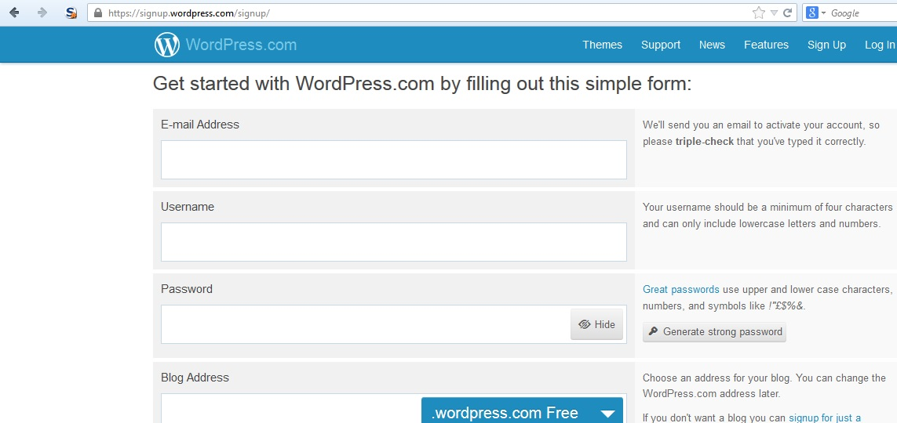

# Test User Registration Process (fa-IR)

آزمایش فرآیند ثبت نام کاربر (فارسی)

|شناسه          |
|------------|
|WSTG-IDNT-02|

## خلاصه

برخی از وب‌سایت‌ها فرآیند ثبت نام کاربر را ارائه می‌کنند که دسترسی به سیستم را برای کاربران خودکار (یا نیمه خودکار) می‌کند. الزامات هویت برای دسترسی بسته به الزامات امنیتی سیستم، از شناسایی مثبت تا عدم وجود متفاوت است. بسیاری از برنامه های عمومی فرآیند ثبت نام و تهیه را کاملاً خودکار می کنند زیرا اندازه پایگاه کاربر مدیریت دستی را غیرممکن می کند. با این حال، بسیاری از برنامه های شرکتی کاربران را به صورت دستی ارائه می کنند، بنابراین این مورد آزمایشی ممکن است اعمال نشود.

## اهداف آزمایش

- بررسی کنید که الزامات هویت برای ثبت نام کاربر با الزامات تجاری و امنیتی همسو باشد.
- فرآیند ثبت نام را تایید کنید.

## چگونه آزمایش کنیم

بررسی کنید که الزامات هویت برای ثبت نام کاربر با الزامات تجاری و امنیتی همسو باشد:

1. آیا کسی می تواند برای دسترسی ثبت نام کند؟
2. آیا ثبت‌نام‌ها قبل از ارائه توسط یک انسان بررسی می‌شوند، یا در صورت رعایت معیارها، به‌طور خودکار اعطا می‌شوند؟
3. آیا یک شخص یا هویت می تواند چندین بار ثبت نام کند؟
4. آیا کاربران می توانند برای نقش ها یا مجوزهای مختلف ثبت نام کنند؟
5. برای موفقیت در ثبت نام چه مدرک هویتی لازم است؟
6. آیا هویت های ثبت شده تایید می شود؟

تایید فرآیند ثبت نام:

1. آیا اطلاعات هویتی به راحتی قابل جعل هستند؟
2. آیا تبادل اطلاعات هویتی در حین ثبت نام قابل دستکاری است؟

### مثال (Example)

در مثال وردپرس زیر، تنها شرط شناسایی یک آدرس ایمیل است که برای ثبت نام کننده قابل دسترسی باشد.

\
*شکل 1-4.3.2: صفحه ثبت نام وردپرس*

در مقابل، در مثال گوگل زیر، الزامات شناسایی شامل نام، تاریخ تولد، کشور، شماره تلفن همراه، آدرس ایمیل و پاسخ CAPTCHA است. در حالی که تنها دو مورد از این موارد (آدرس ایمیل و شماره موبایل) قابل تایید است، الزامات شناسایی سخت‌تر از وردپرس است.

\
*شکل 2-4.3.2: صفحه ثبت نام گوگل*

## اصلاح

الزامات شناسایی و تأیید را که با الزامات امنیتی اطلاعاتی که اعتبارنامه محافظت می کند مطابقت دارد، اجرا کنید.

## ابزارها

یک پروکسی HTTP می تواند ابزار مفیدی برای آزمایش این کنترل باشد.

## منابع

[طراحی ثبت نام کاربر (User Registration Design)](https://mashable.com/2011/06/09/user-registration-design/)
