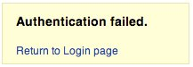

# Testing for Account Enumeration and Guessable User Account (fa-IR)

آزمایش برای شمارش حساب و حساب کاربری قابل حدس زدن (فارسی)

|شناسه          |
|------------|
|WSTG-IDNT-04|

## خلاصه

دامنه این آزمایش بررسی این است که آیا امکان جمع آوری مجموعه ای از نام های کاربری معتبر با تعامل با مکانیسم احراز هویت برنامه وجود دارد یا خیر. این آزمایش برای آزمایش brute force مفید خواهد بود، که در آن آزمایش کننده بررسی می کند که آیا با دادن یک نام کاربری معتبر، امکان یافتن رمز عبور مربوطه وجود دارد یا خیر.

اغلب، برنامه های وب زمانی که یک نام کاربری در سیستم وجود دارد، یا به عنوان یک نتیجه از پیکربندی اشتباه یا به عنوان یک تصمیم طراحی، نشان می دهد. به عنوان مثال، گاهی اوقات زمانی که اعتبارنامه اشتباه ارسال می کنیم، پیامی دریافت می کنیم که یا نام کاربری در سیستم وجود دارد یا رمز عبور ارائه شده اشتباه است. اطلاعات به دست آمده می تواند توسط یک مهاجم برای به دست آوردن لیستی از کاربران در سیستم استفاده شود. از این اطلاعات می توان برای حمله به برنامه وب استفاده کرد، به عنوان مثال، از طریق یک حمله brute force یا نام کاربری و رمز عبور پیش فرض.

آزمایش‌کننده باید با مکانیسم احراز هویت برنامه تعامل داشته باشد تا بفهمد آیا ارسال درخواست‌های خاص باعث می‌شود برنامه به روش‌های مختلف پاسخ دهد یا خیر. این مشکل به این دلیل وجود دارد که اطلاعات منتشر شده از برنامه وب یا وب سرور زمانی که کاربر یک نام کاربری معتبر ارائه می‌کند با زمانی که از نام کاربری نامعتبر استفاده می‌کند متفاوت است.

در برخی موارد، پیامی دریافت می‌شود که نشان می‌دهد اعتبارنامه‌های ارائه شده اشتباه هستند، زیرا از نام کاربری نامعتبر یا رمز عبور نامعتبر استفاده شده است. گاهی اوقات، آزمایش کنندگان می توانند کاربران موجود را با ارسال یک نام کاربری و یک رمز عبور خالی شمارش کنند.

## اهداف آزمایش

- فرآیندهای مربوط به شناسایی کاربر (مانند ثبت نام، ورود به سیستم و غیره) را بررسی کنید.
- در صورت امکان از طریق تجزیه و تحلیل پاسخ، کاربران را برشمارید.

## چگونه آزمایش کنیم

در آزمایش جعبه سیاه، آزمایش کننده هیچ چیز در مورد برنامه خاص، نام کاربری، منطق برنامه، پیام های خطا در صفحه ورود یا امکانات بازیابی رمز عبور نمی داند. اگر برنامه آسیب‌پذیر باشد، آزمایش‌کننده پیام پاسخی دریافت می‌کند که به‌طور مستقیم یا غیرمستقیم، برخی از اطلاعات مفید برای شمارش کاربران را نشان می‌دهد.

### پیام پاسخ HTTP &#x202b;(HTTP Response Message)

#### آزمایش برای اعتبارنامه های معتبر (Testing for Valid Credentials)

هنگامی که یک شناسه کاربری معتبر و رمز عبور معتبر ارسال می کنید، پاسخ سرور را ثبت کنید.

> با استفاده از یک پروکسی وب، به اطلاعات بازیابی شده از این احراز هویت موفق توجه کنید (پاسخ HTTP 200، طول پاسخ).

#### آزمایش برای کاربر معتبر با رمز عبور اشتباه (Testing for Valid User with Wrong Password)

حال، آزمایش کننده باید سعی کند یک شناسه کاربری معتبر و یک رمز عبور اشتباه وارد کند و پیام خطای ایجاد شده توسط برنامه را ثبت کند.

> مرورگر باید پیامی مشابه پیام زیر نمایش دهد:
>
> \
> *شکل 1-4.3.4: احراز هویت ناموفق بود*
>
> بر خلاف هر پیامی که وجود کاربر را آشکار می کند مانند موارد زیر:
>
> `Login for User foo: invalid password`
>
> با استفاده از یک پروکسی وب، به اطلاعات بازیابی شده از این تلاش احراز هویت ناموفق توجه کنید (پاسخ HTTP 200، طول پاسخ).

#### آزمایش برای نام کاربری ناموجود (Testing for a Nonexistent Username)

حال، آزمایش کننده باید سعی کند یک شناسه کاربری نامعتبر و یک رمز عبور اشتباه وارد کند و پاسخ سرور را ثبت کند (آزمایش کننده باید مطمئن باشد که نام کاربری در برنامه معتبر نیست). پیام خطا و پاسخ سرور را ضبط کنید.

> اگر آزمایش‌کننده یک شناسه کاربری ناموجود وارد کند، می‌تواند پیامی شبیه به زیر دریافت کند:
>
> \
> *شکل 2-4.3.4: این کاربر فعال نیست*
>
> یا پیامی مانند زیر:
>
> `Login failed for User foo: invalid Account`
>
> به طور کلی برنامه باید با یک پیام خطا و طول یکسان به درخواست های مختلف نادرست پاسخ دهد. اگر پاسخ‌ها یکسان نیستند، آزمایش‌کننده باید کلیدی را که بین دو پاسخ تفاوت ایجاد می‌کند، بررسی کرده و بیابد. مثلا:
>
> 1. درخواست مشتری: کاربر معتبر / رمز عبور اشتباه
> 2. پاسخ سرور: رمز عبور صحیح نیست
> 3. درخواست مشتری: کاربر اشتباه / رمز عبور اشتباه
> 4. پاسخ سرور: کاربر شناسایی نشد
>
> پاسخ‌های بالا به مشتری (Client) اجازه می‌دهد بفهمد که برای اولین درخواست یک نام کاربری معتبر دارد. بنابراین آنها می توانند با درخواست مجموعه ای از شناسه های کاربری احتمالی و مشاهده پاسخ با برنامه تعامل داشته باشند.
>
> با نگاهی به پاسخ سرور دوم، آزمایش‌کننده به همان شیوه متوجه می‌شود که نام کاربری معتبری ندارد. بنابراین آنها می توانند به همان شیوه تعامل داشته باشند و لیستی از شناسه کاربری معتبر را با نگاه کردن به پاسخ های سرور ایجاد کنند.

### راه های دیگر برای شمارش کاربران (Other Ways to Enumerate Users)

آزمایش کنندگان می توانند کاربران را به روش های مختلفی شمارش کنند، مانند:

#### تجزیه و تحلیل کد خطای دریافت شده در صفحات ورود (Analyzing the Error Code Received on Login Pages)

برخی از برنامه های وب کد خطا یا پیام خاصی را منتشر می کنند که ما می توانیم آن را تجزیه و تحلیل کنیم.

#### تجزیه و تحلیل URL ها و تغییر مسیرهای URL &#x202b;(Analyzing URLs and URL Redirections)

مثلا:

- `http://www.foo.com/err.jsp?User=baduser&Error=0`
- `http://www.foo.com/err.jsp?User=gooduser&Error=2`

همانطور که در بالا مشاهده می شود، هنگامی که یک آزمایش کننده یک شناسه کاربری و رمز عبور را برای برنامه وب ارائه می دهد، پیامی را می بیند که نشان می دهد خطایی در URL رخ داده است. در مورد اول آنها یک شناسه کاربری بد و رمز عبور بد ارائه کرده اند. در دوم، یک شناسه کاربری خوب و یک رمز عبور بد، بنابراین آنها می توانند یک شناسه کاربری معتبر را شناسایی کنند.

#### <div dir="rtl" align="right">URI Probing</div>

گاهی اوقات یک وب سرور در صورتی که درخواستی برای یک فهرست موجود دریافت کند یا نه، پاسخ متفاوتی می دهد. به عنوان مثال در برخی از پورتال ها هر کاربر با یک فهرست مرتبط است. اگر آزمایش‌کنندگان سعی کنند به یک فهرست موجود دسترسی پیدا کنند، ممکن است یک خطای وب سرور دریافت کنند.

برخی از خطاهای رایج دریافتی از وب سرورها عبارتند از:

- کد خطای 403 ممنوعه (Forbidden)
- کد خطای 404 یافت نشد (Not found)

مثال:

- http://www.foo.com/account1- از وب سرور دریافت می کنیم: 403 ممنوعه
- http://www.foo.com/account2 - از وب سرور دریافت می کنیم: 404 فایل یافت نشد

در حالت اول کاربر وجود دارد، اما آزمایش کننده نمی تواند صفحه وب را مشاهده کند، در حالت دوم در عوض کاربر "account2" وجود ندارد. با جمع آوری این اطلاعات، آزمایش کنندگان می توانند کاربران را برشمارند.

#### تجزیه و تحلیل عناوین صفحات وب (Analyzing Web Page Titles)

آزمایش‌کنندگان می‌توانند اطلاعات مفیدی را در عنوان صفحه وب دریافت کنند، جایی که می‌توانند کد خطا یا پیام‌هایی را دریافت کنند که نشان می‌دهد آیا مشکلات مربوط به نام کاربری یا رمز عبور است.

به عنوان مثال، اگر کاربر نتواند در یک برنامه احراز هویت کند و یک صفحه وب دریافت کند که عنوان آن شبیه به:

- `Invalid user`
- `Invalid authentication`

#### تجزیه و تحلیل یک پیام دریافت شده از یک مرکز بازیابی (Analyzing a Message Received from a Recovery Facility)

هنگامی که از یک تسهیلات بازیابی استفاده می کنیم (یعنی یک تابع رمز عبور فراموش شده)، یک برنامه آسیب پذیر ممکن است پیامی را برگرداند که نشان دهد نام کاربری وجود دارد یا نه.

به عنوان مثال، پیام های مشابه زیر:

- `Invalid username: email address is not valid or the specified user was not found.`
- `Valid username: Your password has been successfully sent to the email address you registered with.`

#### پیام خطای دوستانه 404 (Friendly 404 Error Message)

وقتی از کاربری در فهرستی که وجود ندارد درخواست می کنیم، همیشه کد خطای 404 را دریافت نمی کنیم. در عوض، ممکن است "200 OK" را با یک تصویر دریافت کنیم، در این مورد می توانیم فرض کنیم که وقتی تصویر خاص را دریافت می کنیم، کاربر وجود ندارد. این منطق را می توان به سایر پاسخ سرور وب اعمال کرد. ترفند تجزیه و تحلیل خوبی از وب سرور و پیام های برنامه وب است.

#### تجزیه و تحلیل زمان پاسخگویی (Analyzing Response Times)

علاوه بر نگاه کردن به محتوای پاسخ ها، زمان پاسخگویی نیز باید در نظر گرفته شود. به خصوص در مواردی که درخواست باعث تعامل با یک سرویس خارجی می شود (مانند ارسال یک ایمیل رمز عبور فراموش شده)، این می تواند چند صد میلی ثانیه به پاسخ اضافه کند، که می تواند برای تعیین معتبر بودن کاربر درخواست شده استفاده شود.

### حدس زدن کاربران (Guessing Users)

در برخی موارد، شناسه‌های کاربری با سیاست‌های خاص مدیر یا شرکت ایجاد می‌شوند. برای مثال می‌توانیم کاربری را با شناسه کاربری که به ترتیب ایجاد شده است مشاهده کنیم:

```text
CN000100
CN000101
...
```

گاهی اوقات نام های کاربری با نام مستعار REALM و سپس اعداد ترتیبی ایجاد می شوند:

- ا R1001 – کاربر 001 برای REALM1
- ا R2001 – کاربر 001 برای REALM2

در نمونه بالا می‌توانیم اسکریپت‌های shell ساده ایجاد کنیم که شناسه‌های کاربر را می‌سازند و درخواستی را با ابزاری مانند wget ارسال می‌کنیم تا یک جستجوی وب را خودکار کند تا شناسه‌های کاربری معتبر را تشخیص دهد. برای ایجاد یک اسکریپت می توانیم از Perl و Curl نیز استفاده کنیم.

سایر امکانات عبارتند از: - شناسه های کاربری مرتبط با شماره کارت اعتباری، یا به طور کلی اعداد با یک الگو. - شناسه های کاربری مرتبط با نام های واقعی، به عنوان مثال اگر Freddie Mercury شناسه کاربری "fmercury" داشته باشد، ممکن است حدس بزنید که Roger Taylor شناسه کاربری "rtaylor" را داشته باشد.

باز هم، می‌توانیم نام کاربری را از اطلاعات دریافتی از یک پرس و جو LDAP یا از جمع‌آوری اطلاعات Google، به عنوان مثال، از یک دامنه خاص حدس بزنیم. گوگل می تواند از طریق پرس و جوهای خاص یا از طریق اسکریپت یا ابزار پوسته ساده به یافتن کاربران دامنه کمک کند.

> با برشمردن حساب های کاربری، خطر قفل کردن حساب ها پس از تعداد از پیش تعریف شده کاوش های ناموفق (بر اساس سیاست برنامه) وجود دارد. همچنین، گاهی اوقات، آدرس IP شما می تواند توسط قوانین پویا در فایروال برنامه یا سیستم جلوگیری از نفوذ ممنوع (ban) شود.

### آزمایش جعبه خاکستری (Gray-Box Testing)

#### آزمایش پیام های خطای احراز هویت (Testing for Authentication Error Messages)

بررسی کنید که برنامه برای هر درخواست مشتری که احراز هویت ناموفق ایجاد می کند، به همان شیوه پاسخ می دهد. برای این موضوع، آزمایش جعبه سیاه و آزمایش جعبه خاکستری بر اساس تجزیه و تحلیل پیام ها یا کدهای خطا دریافت شده از برنامه وب، مفهوم یکسانی دارند.

> برنامه باید برای هر تلاش ناموفق برای احراز هویت به همان شیوه پاسخ دهد.
>
> به عنوان مثال: اعتبارنامه های ارسال شده معتبر نیستند

## اصلاح

اطمینان حاصل کنید که برنامه در پاسخ به نام حساب نامعتبر، رمز عبور یا سایر اطلاعات کاربری که در طول فرآیند ورود به سیستم وارد شده اند، پیام های خطای عمومی ثابتی را برمی گرداند.

اطمینان حاصل کنید که حساب‌های پیش‌فرض سیستم و حساب‌های آزمایشی قبل از عرضه سیستم به تولید (یا قرار دادن آن در معرض یک شبکه غیرقابل اعتماد) حذف شده‌اند.

## ابزارها

- [OWASP Zed Attack Proxy (ZAP)](https://www.zaproxy.org)
- [curl](https://curl.haxx.se/)
- [PERL](https://www.perl.org)

## منابع

- [Username Enumeration Vulnerabilities](https://www.gnucitizen.org/blog/username-enumeration-vulnerabilities/)
- [Prevent WordPress Username Enumeration](https://www.jinsonvarghese.com/prevent-wordpress-username-enumeration/)
- [Marco Mella, Sun Java Access & Identity Manager Users enumeration](https://www.exploit-db.com/exploits/32762)
